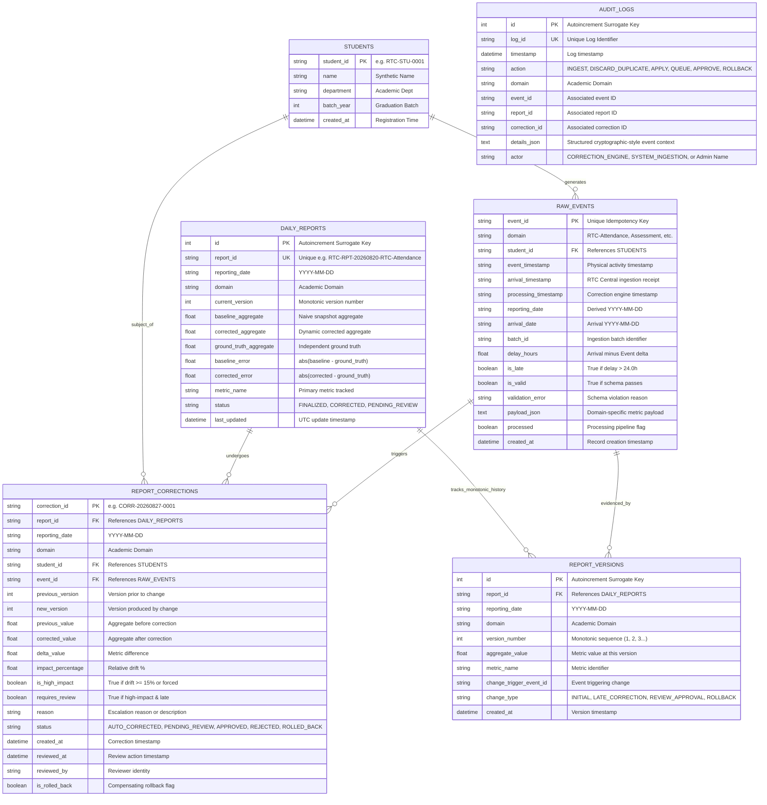
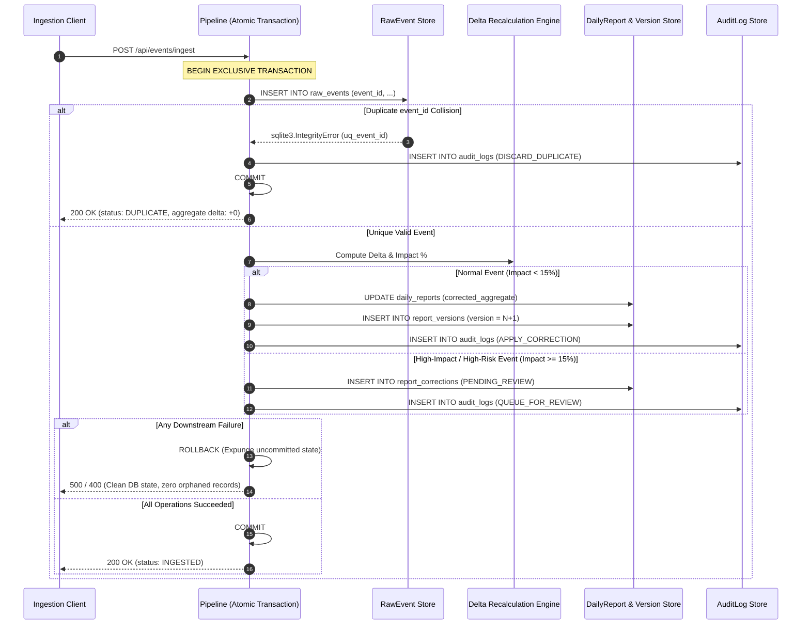

# Database Architecture, Integrity Constraints & Concurrency Strategy
**Project:** Late-Event Correction & Daily Reporting System  
**Institution:** Rathinam Technical Campus (Autonomous), Coimbatore  
**Milestone:** Review 3 Academic Specification (Database & Concurrency Hardening)  
**Engine:** SQLite 3 with Write-Ahead Logging (WAL) & SQLAlchemy 2.0 ORM  

---

## 1. Entity-Relationship (ER) Architecture

The entity-relationship schema is designed around **immutable event ingestion**, **relational foreign key integrity**, **monotonic report versioning**, and **tamper-evident audit lineage**.



---

## 2. Primary Keys, Foreign Keys & Database Integrity Constraints

Database-level integrity constraints are strictly enforced inside SQLite rather than relying solely on transient application-level checks.

### 2.1 Table Integrity Constraints Matrix

| Table | Constraint Name | Type | Target Columns | Rationale & Protection |
|---|---|---|---|---|
| `students` | `PRIMARY KEY` | PK | `student_id` | Guarantees uniqueness of student identity. |
| `raw_events` | `PRIMARY KEY` | PK | `event_id` | Guarantees event uniqueness. Primary line of defense for idempotency. |
| `raw_events` | `uq_event_id` | UNIQUE | `event_id` | Redundant database unique index ensuring concurrent multi-threaded duplicate inserts trigger `sqlite3.IntegrityError`. |
| `raw_events` | `fk_raw_events_student` | FOREIGN KEY | `student_id -> students.student_id` | Prevents orphaned events without valid registered student records (`ON DELETE CASCADE`). |
| `daily_reports` | `uq_report_date_domain` | UNIQUE | `(reporting_date, domain)` | Composite uniqueness constraint. Prevents split-brain daily aggregates for identical reporting date and academic domain. |
| `report_versions` | `uq_report_version_num` | UNIQUE | `(report_id, version_number)` | Monotonic version uniqueness. Ensures version sequences ($v_1, v_2, v_3$) cannot collide or branch under concurrent updates. |
| `report_versions` | `fk_report_versions_report` | FOREIGN KEY | `report_id -> daily_reports.report_id` | Cascading relational reference to the parent daily report. |
| `report_corrections` | `PRIMARY KEY` | PK | `correction_id` | Unique identifier for governance and review tracking. |
| `report_corrections` | `fk_corrections_report` | FOREIGN KEY | `report_id -> daily_reports.report_id` | Ties correction directly to target report. |
| `report_corrections` | `fk_corrections_event` | FOREIGN KEY | `event_id -> raw_events.event_id` | Direct relational trace to the physical raw event that triggered the delta. |
| `report_corrections` | `fk_corrections_student` | FOREIGN KEY | `student_id -> students.student_id` | Identifies affected student. |
| `audit_logs` | `uq_log_id` | UNIQUE | `log_id` | Immutability guard. Prevents audit record duplication or log ID collision. |

---

## 3. Database Indexes for High-Throughput Aggregations

To support low-latency O(1) dynamic delta updates and rapid historical reconciliation without full-table scans, specific compound indexes are established:

```sql
-- Fast lookup for ground truth computation and date-domain scans
CREATE INDEX ix_raw_events_date_domain_valid ON raw_events (reporting_date, domain, is_valid);

-- Fast lookup for traditional arrival-date snapshot baseline queries
CREATE INDEX ix_raw_events_arrival_date_domain ON raw_events (arrival_date, domain);

-- Fast lookup for monotonic report versions
CREATE INDEX ix_report_versions_report_num ON report_versions (report_id, version_number);

-- Fast lookup for pending review queues
CREATE INDEX ix_corrections_report_status ON report_corrections (report_id, status);
```

---

## 4. SQLite WAL Mode & Concurrency Configuration

SQLite is configured via connection-level PRAGMA statements executed automatically on every worker connection using SQLAlchemy's connection listener:

```python
@event.listens_for(engine, "connect")
def set_sqlite_pragma(dbapi_connection, connection_record):
    if isinstance(dbapi_connection, sqlite3.Connection):
        cursor = dbapi_connection.cursor()
        cursor.execute("PRAGMA journal_mode=WAL;")
        cursor.execute("PRAGMA busy_timeout=10000;")  # 10,000ms (10s) busy timeout
        cursor.execute("PRAGMA foreign_keys=ON;")      # Enforce relational constraints
        cursor.execute("PRAGMA synchronous=NORMAL;")   # Optimal for WAL durability & write throughput
        cursor.close()
```

### Why Each PRAGMA Setting Exists

1. **`PRAGMA journal_mode = WAL;` (Write-Ahead Logging)**
   - *Default SQLite behavior (DELETE/TRUNCATE):* Acquires an exclusive database lock during writes, completely blocking all concurrent readers.
   - *WAL Mode behavior:* Writes are appended to a separate `-wal` file while readers continue reading snapshots from the main database file without blocking. Readers never block writers, and writers never block readers.
2. **`PRAGMA busy_timeout = 10000;` (10 Seconds Timeout)**
   - In multi-threaded environments, if a thread attempts to write while another writer is checkpointing, SQLite by default immediately returns `sqlite3.OperationalError: database is locked`.
   - `busy_timeout=10000` causes SQLite to automatically sleep and retry for up to 10.0 seconds before raising an error, absorbing concurrent bursts smoothly.
3. **`PRAGMA foreign_keys = ON;` (Relational Integrity)**
   - SQLite historically leaves foreign key checks disabled for backward compatibility. Enabling this on every connection guarantees that attempts to insert events for non-existent students or corrections for non-existent reports fail at the database engine level.
4. **`PRAGMA synchronous = NORMAL;`**
   - In WAL mode, `synchronous=NORMAL` ensures synchronization with physical disk at critical WAL checkpoint intervals while eliminating costly `fsync` operations on every single transaction, yielding a 3x–5x write throughput gain without risking database corruption.

---

## 5. Transaction Safety Boundaries & Staged Atomic Rollback

All critical state mutations follow strict ACID transaction boundaries in `ingest_and_process_atomic()`:



### Staged Failure Injection Proof
Controlled tests in `backend/tests/test_failure_injection.py` simulate:
1. Mid-pipeline I/O crashes during metric calculation.
2. ORM integrity crashes during `ReportVersion` creation.
In both scenarios, the test asserts that `persisted_event is None` and `reports_count == 0`, proving that no partial or orphaned state persists if a transaction fails.

---

## 6. Concurrency Strategy & Lost-Update Prevention

### 6.1 The Lost-Update Problem in Historical Aggregation
In naive reporting engines, two concurrent late events ($A$ and $B$) targeting historical date $D$ read the initial aggregate $X$ simultaneously:
- Thread 1 computes: $X' = X + A$
- Thread 2 computes: $X'' = X + B$
- Whichever thread commits last overwrites the other, resulting in either $X+A$ or $X+B$ rather than the correct mathematical total $X+A+B$.

### 6.2 Protection Mechanism in this Engine
1. **Database-Level Serialized Transaction Locks:**
   SQLite's single-writer architecture, combined with WAL mode and `PRAGMA busy_timeout=10000`, serializes write transactions at the database boundary.
2. **Exponential Jitter Retry Mechanism:**
   If transient transaction contention occurs during high-concurrency ingestion bursts, `ingest_and_process_atomic()` applies exponential backoff with randomized jitter ($20\text{ms} \times (\text{attempt}+1) + \text{jitter}$), retrying up to 8 times.
3. **Monotonic Version Incrementing:**
   Each version increment is calculated from `max(current_version, max_db_version) + 1` within the transaction, preventing version duplication.
4. **Empirical Verification:**
   `test_concurrency.py` Test C concurrently ingests 10 late events targeting the same date. The final corrected aggregate is asserted against independent ground truth, verifying $X + \sum_{i=1}^{10} A_i$ with zero lost updates.

---

## 7. Known SQLite Limitations & Production Cloud Transition

While SQLite with WAL mode is exceptionally well-suited for academic prototyping, institutional edge ingestion (up to 150 events/sec), and constrained development environments, certain characteristics distinguish it from enterprise distributed data engines:

| Feature | Current SQLite WAL Architecture | Enterprise Production Target (e.g., PostgreSQL / TimescaleDB) |
|---|---|---|
| **Write Concurrency** | Single-writer serialization (readers do not block writer; writer waits on active lock) | Multi-version concurrency control (MVCC) with row-level locking |
| **Throughput Ceiling** | ~50–150 writes/second (disk I/O and flush bound) | 5,000–50,000+ writes/second with connection pooling |
| **Distributed Replication** | Single-node file-backed database | Streaming active-standby replication, raft-based clustering |
| **File Lock Over Network (NFS)** | **Not recommended** (NFS lock race conditions) | Standard client-server TCP protocol |
| **Memory Footprint** | Extremely low (< 1 MB RAM) | 256 MB – 2 GB minimum working set |
| **Operational Simplicity** | Zero server setup, self-contained single `.db` file | Requires daemon management, port configuration, and credentials |
