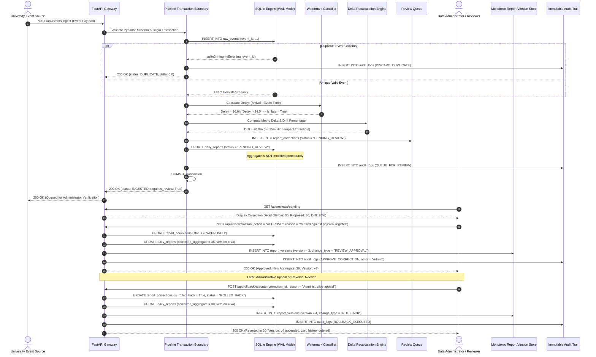
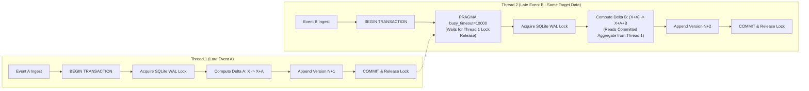

# Final System Architecture & Late-Event Sequence Flow
**Project:** Late-Event Correction & Daily Reporting System  
**Institution:** Rathinam Technical Campus (Autonomous), Coimbatore  
**Milestone:** Review 3 Academic Specification (Architecture & Lineage Design)  

---

## 1. End-to-End System Architecture

The Rathinam Technical Campus (RTC) Late-Event Correction and Daily Reporting System provides a mathematically provable, concurrency-safe pipeline that automatically detects out-of-order institutional events, isolates duplicate entries, recalculates historical daily aggregates in $O(1)$ time, enforces human-in-the-loop governance for high-impact alterations, and preserves monotonic report versioning and immutable audit logs.

```mermaid
flowchart TD
    subgraph Sources["1. Institutional Event Producers"]
        S1["RTC-Attendance<br/>(Biometric & Classroom Gateways)"]
        S2["RTC-Assessment<br/>(Mid-Term & End-Sem Portals)"]
        S3["RTC-Learning<br/>(LMS Moodle / Quiz Activity)"]
        S4["RTC-Placement<br/>(Drive Offers & Interview Results)"]
    end

    subgraph Ingestion["2. Ingestion & Contract Enforcement"]
        API["FastAPI REST Endpoint<br/>(POST /api/events/ingest)"]
        Pydantic["Pydantic Strict Schema Validation<br/>(EventIngestRequest)"]
    end

    subgraph ConcurrencyLayer["3. Database Concurrency & Integrity Layer"]
        WAL["SQLite Write-Ahead Logging (WAL)<br/>PRAGMA journal_mode=WAL"]
        Timeout["Busy Timeout Contention Guard<br/>PRAGMA busy_timeout=10000"]
        FK["Relational Integrity Enforcement<br/>PRAGMA foreign_keys=ON"]
        AtomicTx["Atomic Transaction Boundary<br/>(ingest_and_process_atomic)"]
        IdemGuard{"Idempotency Guard<br/>UNIQUE(event_id)"}
    end

    subgraph Storage["4. Event Store & Classification"]
        RawDB[("Raw Events Store<br/>(raw_events table)")]
        Watermark["Watermark & Event-Time Classifier<br/>Delay = ArrivalTime - EventTime"]
        Branch{"Lateness Check<br/>Delay > 24.0h?"}
        OnTime["On-Time Event Pipeline<br/>(Assigned to Event Date)"]
        Late["Late-Arriving Event Pipeline<br/>(Triggers Recalculation Engine)"]
    end

    subgraph Engine["5. Delta Recalculation & Impact Scoring"]
        DeltaEng["Stateful Delta Recalculation Engine<br/>Delta = f(Domain, Payload)"]
        ImpactScore["Relative Drift Scoring<br/>Drift% = abs(Delta) / OldAggregate * 100"]
        ReviewGate{"Governance Filter<br/>Drift >= 15% OR High-Risk Outcome?"}
        AutoApply["Autonomous Application<br/>(Status: AUTO_CORRECTED)"]
        HumanReview["Human-in-the-Loop Review Queue<br/>(Status: PENDING_REVIEW)"]
    end

    subgraph Governance["6. Human Governance & Lineage"]
        AdminRole["Data Administrator / Dean<br/>(Web Review Interface)"]
        ApproveAction["Approved with Reason<br/>POST /api/reviews/action"]
        RejectAction["Rejected with Justification<br/>(Prior Aggregate Preserved)"]
        RollbackAction["Compensating Rollback<br/>POST /api/rollback/execute"]
    end

    subgraph Reporting["7. Versioned Storage & Audit Ledger"]
        DailyRpt[("Daily Reports Store<br/>UNIQUE(reporting_date, domain)")]
        VersionTree[("Monotonic Version Tree<br/>UNIQUE(report_id, version_number)<br/>v1 -> v2 -> v3 -> v4")]
        AuditLedger[("Immutable Cryptographic Audit Trail<br/>(audit_logs table)")]
        Reconciler["Independent Ground-Truth Reconciler<br/>assert Corrected(D) == GroundTruth(D)"]
    end

    subgraph UI["8. Stakeholder Observability Dashboard"]
        ViteUI["React 18 / TailwindCSS Web Interface<br/>(Overview, Reports, Events, Reviews, Audit, Rollback, Benchmarks)"]
    end

    %% Data Connections
    Sources --> API
    API --> Pydantic
    Pydantic --> AtomicTx
    AtomicTx --> IdemGuard

    IdemGuard -- "Duplicate ID" --> AuditLedger
    IdemGuard -- "Unique Valid ID" --> RawDB

    RawDB --> Watermark
    Watermark --> Branch
    Branch -- "Delay <= 24h" --> OnTime
    Branch -- "Delay > 24h" --> Late

    OnTime --> DeltaEng
    Late --> DeltaEng
    DeltaEng --> ImpactScore
    ImpactScore --> ReviewGate

    ReviewGate -- "Drift < 15%" --> AutoApply
    ReviewGate -- "Drift >= 15% or Forced" --> HumanReview

    HumanReview --> AdminRole
    AdminRole --> ApproveAction
    AdminRole --> RejectAction
    AdminRole -.-> RollbackAction

    AutoApply --> DailyRpt
    AutoApply --> VersionTree
    AutoApply --> AuditLedger

    ApproveAction --> DailyRpt
    ApproveAction --> VersionTree
    ApproveAction --> AuditLedger

    RejectAction --> AuditLedger
    RollbackAction --> DailyRpt
    RollbackAction --> VersionTree
    RollbackAction --> AuditLedger

    DailyRpt --> Reconciler
    RawDB -.-> Reconciler
    Reconciler --> ViteUI

    DailyRpt --> ViteUI
    VersionTree --> ViteUI
    HumanReview --> ViteUI
    AuditLedger --> ViteUI
    WAL -.-> ConcurrencyLayer
    Timeout -.-> ConcurrencyLayer
    FK -.-> ConcurrencyLayer
```

---

## 2. Sequence Flow: Late Event Ingestion to Human Review & Monotonic Versioning

The sequence diagram below models the exact execution lifecycle when an out-of-order event arrives with high-impact drift, is escalated to administrative review, approved, and subsequently reverted via a compensating rollback.

---

## 3. Concurrency Protection & Transaction Isolation Layer

### Key Architectural Guarantees:
1. **Zero Lost Updates:** Because Thread 2 waits on `busy_timeout` until Thread 1 commits, Thread 2 reads the newly committed state $X+A$, guaranteeing the final aggregate is $X+A+B$.
2. **Monotonic Version Numbering:** Version numbers strictly increase ($v_1 \rightarrow v_2 \rightarrow v_3 \dots$) without gaps or branch collisions.
3. **Compensating Rollbacks:** Rollbacks append a new state record ($v_4$) rather than deleting or rewriting previous rows ($v_1, v_2, v_3$), ensuring permanent audit compliance.
